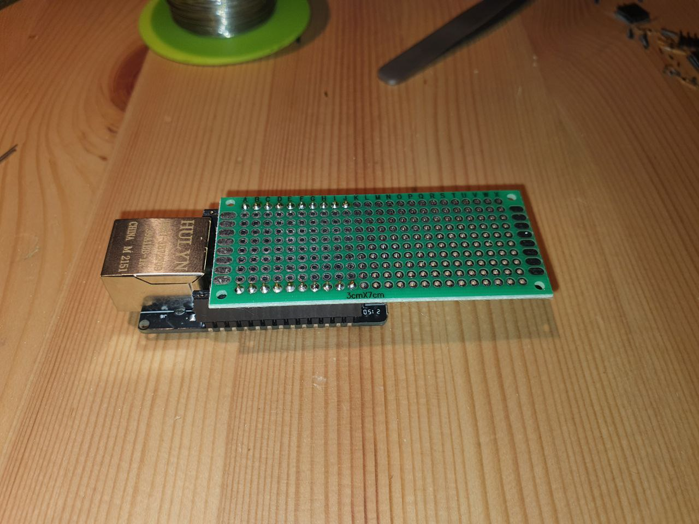

> **WARNING:** THIS REPOSITORY IS ARCHIVED. DEVELOPMENT CONTINUES IN THE [PORTAL300](/shackspace/portal300) monorepo.

# _Busch Welcome_ Interface for Portal300

This repository implements an interface to the [Busch Welcome](https://www.busch-jaeger.de/busch-welcome) installed in the Ulmer Straße 300.

This code is part of the project [Portal 300](https://wiki.shackspace.de/infrastruktur/portal300), the new portal infrastructure for shackspace.

## Hardware

The microcontroller board for this project is the [WT32-ETH01](http://www.wireless-tag.com/portfolio/wt32-eth01/) which has a LAN 8720 PHY installed.

More information on this board can be found [in this repository](https://github.com/ldijkman/WT32-ETH01-LAN-8720-RJ45-).

### ESP32 interfaces

- The ESP32 will interface network via RMII ethernet
- IO39 is used as an output to press the "Open Door" button and unlock the front door.
- IO15 is used as an input, responding to the door bell.

### Adapter Board

We created a small adapter board that is sitting on top of the WT32-ETH01:

The wire colors transport the following signals:

| Wire   | Signal                                          |
| ------ | ----------------------------------------------- |
| gray   | GND                                             |
| orange | Power Supply (5V)                               |
| yellow | doorbell was triggered (gray ist reference GND) |
| brown  | emitter for "Open Door" button                  |
| purple | collector for "Open Door" button                |
